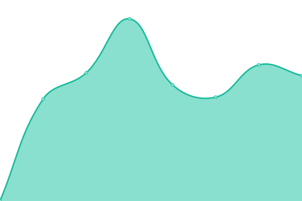
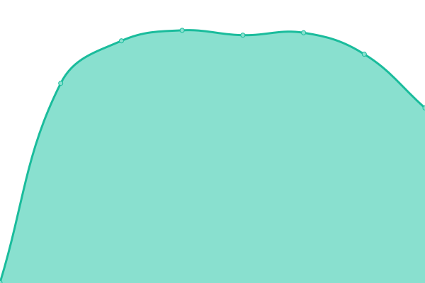

# [📈 Live Status](https://krachim.github.io/status): <!--live status--> **🟩 All systems operational**

This repository contains the open-source uptime monitor and status page for [Achim](https://krachim.github.io/status), powered by [Upptime](https://github.com/upptime/upptime).

With [Upptime](https://upptime.js.org), you can get your own unlimited and free uptime monitor and status page, powered entirely by a GitHub repository. We use [Issues](https://github.com/krachim/status/issues) as incident reports, [Actions](https://github.com/krachim/status/actions) as uptime monitors, and [Pages](https://krachim.github.io/status) for the status page.

<!--start: status pages-->
<!-- This summary is generated by Upptime (https://github.com/upptime/upptime) -->
<!-- Do not edit this manually, your changes will be overwritten -->
<!-- prettier-ignore -->
| URL | Status | History | Response Time | Uptime |
| --- | ------ | ------- | ------------- | ------ |
|  [Koelner Institut](https://ilias.koelner-institut.de) | 🟩 Up | [koelner-institut.yml](https://github.com/krachim/status/commits/HEAD/history/koelner-institut.yml) | 

 1146ms
     
 | 

<a href="https://krachim.github.io/status/history/koelner-institut">100.00%</a>
    

|  [Holzauge Fotografie](https://holzauge-fotografie.de) | 🟩 Up | [holzauge-fotografie.yml](https://github.com/krachim/status/commits/HEAD/history/holzauge-fotografie.yml) | 

 583ms
     
 | 

<a href="https://krachim.github.io/status/history/holzauge-fotografie">100.00%</a>
    

|  [Vato Sikharulidze](https://www.vatosikharulidze.com) | 🟩 Up | [vato-sikharulidze.yml](https://github.com/krachim/status/commits/HEAD/history/vato-sikharulidze.yml) | 

 538ms
     
 | 

<a href="https://krachim.github.io/status/history/vato-sikharulidze">100.00%</a>
    

|  [Moritz Hagedorn](https://moritzhagedorn.com) | 🟩 Up | [moritz-hagedorn.yml](https://github.com/krachim/status/commits/HEAD/history/moritz-hagedorn.yml) | 

 486ms
     
 | 

<a href="https://krachim.github.io/status/history/moritz-hagedorn">100.00%</a>
    

|  [Malte van de Water](https://maltevandewater.de) | 🟩 Up | [malte-van-de-water.yml](https://github.com/krachim/status/commits/HEAD/history/malte-van-de-water.yml) | 

 803ms
     
 | 

<a href="https://krachim.github.io/status/history/malte-van-de-water">100.00%</a>
    

|  [Intissar Belaid](https://intissarbelaid.com) | 🟩 Up | [intissar-belaid.yml](https://github.com/krachim/status/commits/HEAD/history/intissar-belaid.yml) | 

 622ms
     
 | 

<a href="https://krachim.github.io/status/history/intissar-belaid">100.00%</a>
    

<!--end: status pages-->

[**Visit our status website →**](https://krachim.github.io/status)

## 📄 License

- Powered by: [Upptime](https://github.com/upptime/upptime)
- Code: [MIT](./LICENSE) © [Achim](https://krachim.github.io/status)
- Data in the `./history` directory: [Open Database License](https://opendatacommons.org/licenses/odbl/1-0/)
